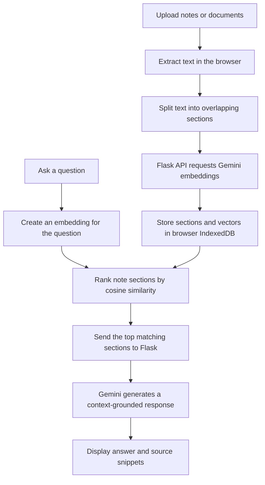

# NoteMind Web

**A browser-based AI study notebook that helps you organise notes, ask questions about your material, and turn documents into study aids.**

<p align="left">
  <a href="https://note-mind-web.vercel.app"><strong>Live Demo</strong></a> ·
  <a href="https://github.com/balushetty07/NoteMind-Web"><strong>Source Code</strong></a> ·
  <a href="https://github.com/balushetty07/NoteMind-AI"><strong>Related AI Project</strong></a>
</p>

NoteMind Web combines a responsive notebook interface with a Flask API and Google Gemini. Add documents or images, let the app extract and index their text, and ask questions that are answered using the most relevant sections of your own notes. Answers include source snippets so you can inspect the supporting material.

## Contents

- [Project Scope and Learning Goals](#project-scope-and-learning-goals)
- [Features](#features)
- [How It Works](#how-it-works)
- [Technology Stack](#technology-stack)
- [Supported Files](#supported-files)
- [Getting Started](#getting-started)
- [Environment Configuration](#environment-configuration)
- [Deploying to Vercel](#deploying-to-vercel)
- [API Endpoints](#api-endpoints)
- [Project Structure](#project-structure)
- [Data Storage and Privacy](#data-storage-and-privacy)
- [Known Limitations and Trade-Offs](#known-limitations-and-trade-offs)
- [Security Considerations](#security-considerations)
- [Troubleshooting](#troubleshooting)

## Project Scope and Learning Goals

NoteMind Web is a **student-built learning project and functional prototype**. It explores how a web application can combine document processing, embeddings, similarity-based retrieval, and a large language model to support studying from personal notes.

The goal is to understand and demonstrate the building blocks behind an AI study assistant—not to reproduce Google NotebookLM or claim the same breadth, reliability, scale, or production maturity. The interface and processing pipeline are intentionally kept understandable so that the project can be studied, explained, tested, and improved over time.

This repository uses the Google Gemini API for embeddings and AI-generated content. **It does not train or provide its own foundation model.** The application's document handling, retrieval workflow, browser storage, Flask routes, and user interface are the software components implemented in this project.

NoteMind Web is an independent project and is **not affiliated with, endorsed by, or a replacement for Google or NotebookLM**.

### What this project demonstrates

- Connecting a browser-based interface to a Python Flask backend.
- Extracting text from documents and preparing it for retrieval.
- Creating embeddings and ranking text sections by similarity.
- Supplying retrieved context to a generative model and showing source snippets.
- Using an external AI API securely through a server-side environment variable.
- Documenting trade-offs, testing failure cases, and deploying a web application.

## Features

### Ask questions about your notes

- Ask natural-language questions about uploaded material.
- Uses text embeddings and similarity scoring to retrieve relevant sections before generating an answer.
- Displays source labels and lets you inspect retrieved text snippets.
- Keeps recent conversation turns available as context for follow-up questions.
- Includes suggested questions to help you get started.

### Import documents and images

- Supports `.txt`, `.md`, `.pdf`, `.png`, `.jpg`, `.jpeg`, and `.webp` files.
- Extracts selectable text from PDFs in the browser.
- Uses Gemini-based OCR for images and as a fallback for scanned PDFs with no extractable text.
- Splits extracted text into smaller sections before indexing it.
- Lets you include or exclude individual notes from retrieval and remove notes you no longer need.

### Generate study material

- **Summaries:** produces an overview, key points, and important terms where available.
- **Quizzes:** generates five multiple-choice questions, with four options per question, feedback, explanations, and a final score.
- **Flashcards:** generates question-and-answer cards with previous/next navigation, shuffle, and CSV export for use in study tools.

### Notebook and chat management

- Supports multiple chat sessions with automatically generated titles.
- Create a new chat, clear the current chat, or delete a chat.
- Export a conversation as a Markdown file.
- Copy AI responses.
- Persists notes, embeddings, and chats in browser storage so they can be restored after a refresh on the same browser profile.

### Interface

- Responsive notebook layout for desktop and smaller screens.
- Dark and light themes.
- Drag-and-drop file upload as well as file selection.
- Source management controls and an About page describing the application flow.

## How It Works

NoteMind uses a retrieval-augmented generation (RAG) workflow. The browser handles document reading, chunking, local storage, and similarity ranking; the Flask server provides API endpoints and communicates with Gemini.



In more detail:

1. The browser extracts text from the selected file. Image files are sent to the server for OCR; scanned PDFs use OCR when ordinary PDF text extraction returns no text.
2. The text is divided into sections of roughly 800 characters, with overlap to help preserve context across section boundaries.
3. The server requests 768-dimensional embeddings from Gemini. The browser normalises and stores those vectors alongside the section text in IndexedDB.
4. When a question is submitted, NoteMind embeds the question and ranks stored sections using the dot product of normalised vectors (cosine similarity).
5. The five highest-ranked sections are sent as context to the answer endpoint. The prompt instructs Gemini to answer using only the supplied context, identify the source, and say when the notes do not contain the answer.
6. The interface displays the response and provides source controls to inspect the retrieved text.

## Technology Stack

| Layer | Technologies | Purpose |
|---|---|---|
| Frontend | HTML, CSS, vanilla JavaScript | Notebook interface, file handling, chat UI, retrieval ranking, and study interactions |
| PDF processing | PDF.js | Extract text from PDFs and render scanned pages for OCR fallback |
| Backend | Python, Flask | Serves the interface and exposes the application's JSON API endpoints |
| HTTP client | `requests` | Sends embedding, OCR, and text-generation requests to Gemini |
| AI services | Google Gemini API | Text embeddings, image OCR/transcription, answers, summaries, quizzes, flashcards, and chat titles |
| Browser storage | IndexedDB and `localStorage` | Stores notes, embeddings, chats, and theme preference locally in the browser |
| Deployment | Vercel | Hosts the Flask application |

## Supported Files

| File type | Processing method |
|---|---|
| `.txt` | Read directly in the browser |
| `.md` | Read directly in the browser |
| `.pdf` | Extract selectable text with PDF.js; use OCR if no text is extracted |
| `.png`, `.jpg`, `.jpeg`, `.webp` | Send image data through the Flask OCR endpoint and Gemini |

For scanned PDFs, OCR is limited to the first 20 pages. OCR quality depends on image clarity, handwriting, contrast, and document layout.

## Getting Started

### Prerequisites

- Python installed on your computer.
- A Google Gemini API key with access to the required Gemini API models.
- Git, if you plan to clone the repository.

### 1. Clone the repository

```bash
git clone https://github.com/balushetty07/NoteMind-Web.git
cd NoteMind-Web
```

### 2. Create and activate a virtual environment

**Windows PowerShell**

```powershell
py -m venv .venv
.\.venv\Scripts\Activate.ps1
```

**macOS / Linux**

```bash
python3 -m venv .venv
source .venv/bin/activate
```

### 3. Install dependencies

```bash
python -m pip install --upgrade pip
python -m pip install -r requirements.txt
```

The current `requirements.txt` contains:

- `Flask` — web framework and API routes.
- `requests` — HTTP requests to the Gemini API.

### 4. Configure the API key

Set the `GEMINI_API_KEY` environment variable before starting the app.

**Windows PowerShell**

```powershell
$env:GEMINI_API_KEY = "YOUR_GEMINI_API_KEY"
```

**Windows Command Prompt**

```bat
set GEMINI_API_KEY=YOUR_GEMINI_API_KEY
```

**macOS / Linux**

```bash
export GEMINI_API_KEY="YOUR_GEMINI_API_KEY"
```

Replace the placeholder with your own key. Do not commit your real API key to GitHub. The repository's `.gitignore` excludes `secret.py`, `.env`, and Vercel's local directory; use environment variables as the preferred configuration method.

### 5. Run the application locally

With the virtual environment active and `GEMINI_API_KEY` set in the same terminal:

```bash
python -m flask --app index run --debug
```

Open the local address printed by Flask, typically <http://127.0.0.1:5000>.

> Keep the API key on the server. Do not place it in `index.html`, frontend JavaScript, or any other browser-delivered code.

## Environment Configuration

| Variable | Required | Description |
|---|---|---|
| `GEMINI_API_KEY` | Yes for AI features | API key used by the Flask backend to authenticate requests to Google Gemini |

If the key is missing, the application can serve the page, but API-backed features will return an error until a valid key is configured.

## Deploying to Vercel

The production deployment is available at **[note-mind-web.vercel.app](https://note-mind-web.vercel.app)**.

To deploy your own instance:

1. Push the repository to GitHub.
2. Import `balushetty07/NoteMind-Web` (or your fork) into Vercel.
3. Keep the repository root as the project root and let Vercel detect the Flask application.
4. In the Vercel project settings, add `GEMINI_API_KEY` as an environment variable for the relevant deployment environment.
5. Deploy the project. Redeploy after changing environment variables so the deployment uses the updated configuration.
6. Open the deployment and test file upload, question answering, OCR, summaries, quizzes, and flashcards.

Do not expose the API key in repository files or frontend code. A public demo can incur API usage, so protect the key and monitor usage and quotas in your Google AI project.

## API Endpoints

These endpoints are used internally by the frontend. They are documented here to make the code easier to understand; they are not presented as a versioned public API.

| Method | Endpoint | Purpose |
|---|---|---|
| `GET` | `/` | Serves `index.html`. |
| `POST` | `/api/embed` | Requests Gemini embeddings for a list of text sections. |
| `POST` | `/api/answer` | Generates an answer using the question, retrieved note context, and recent conversation history. |
| `POST` | `/api/ocr` | Transcribes text from an image using Gemini. |
| `POST` | `/api/study` | Generates a notes summary, multiple-choice quiz, or flashcards based on the requested mode. |
| `POST` | `/api/title` | Generates a short title for a chat based on its first question. |

The Flask routes validate required inputs and return JSON responses. External Gemini requests can fail because of network problems, API quotas, unavailable models, or invalid API configuration; the application returns error messages for these cases.

## Project Structure

```text
NoteMind-Web/
├── index.py          # Flask application and Gemini-backed API endpoints
├── index.html        # Frontend UI, browser-side document processing, and RAG logic
├── requirements.txt  # Python dependencies (Flask and requests)
└── .gitignore        # Excludes local secrets, caches, and Vercel files
```

## Data Storage and Privacy

- **Browser-local data:** Note text, section embeddings, and chat history are stored in IndexedDB in the current browser profile. The theme preference is stored in `localStorage`.
- **No application database:** The Flask application does not implement a server-side database or account system for user notes.
- **External AI processing:** Text is sent through the Flask backend to Gemini for embeddings and answer generation. Images and scanned PDF pages may also be sent for OCR. Do not upload confidential, personal, or sensitive documents unless you are comfortable with that processing.
- **Device and browser scope:** Local data is not automatically synced between browsers or devices. Clearing site data or using a different browser profile can make locally stored notes and chats unavailable.
- **API-key handling:** The API key is read by the server from `GEMINI_API_KEY`; keep it private and rotate it if it is ever exposed.

## Known Limitations and Trade-Offs

NoteMind Web is a learning prototype, so these limitations are part of its current scope—not claims that it offers the same experience as a mature commercial product.

### AI and retrieval quality

- Answers depend on the quality of the uploaded material, text extraction, section splitting, embedding quality, and retrieval ranking. The most relevant passage is not guaranteed to be retrieved every time.
- The current workflow sends the top five similarity-ranked text sections as context. Useful information outside those sections may be missed, especially in very long or poorly structured documents.
- AI-generated answers, summaries, quizzes, and flashcards may be inaccurate, incomplete, repetitive, or based on a misunderstanding of the notes. Source snippets help with checking, but do not guarantee every claim is supported. Verify important answers against the original material.
- The application is designed to work with material supplied by the user. It is not a general-purpose web search engine and does not independently verify answers against the internet.
- It relies on the Google Gemini API rather than a model trained specifically for NoteMind. Output quality, available models, latency, and API behavior can change with the external service.

### Document processing

- OCR may fail or make mistakes with handwriting, low-resolution images, unusual fonts, tables, multi-column layouts, mathematical notation, and complex page formatting.
- Scanned-PDF OCR fallback processes only the first 20 pages. PDF text extraction may not preserve the original document's layout or reading order.
- The supported file list is limited to plain text, Markdown, PDFs, and the listed image formats. Other formats, password-protected PDFs, or unusually large files may not work as expected.
- Splitting documents into text sections can separate information that belongs together, such as a question and its answer, a heading and its paragraph, or a table and its labels.

### Storage, privacy, and availability

- Notes, embeddings, and chat history are stored in the current browser profile. They are not synchronised across devices, and clearing browser site data may remove them. The project does not currently implement user accounts or a server-side notes database.
- Browser-local storage should not be treated as encrypted secure storage. Do not use it for confidential or sensitive material.
- Text used for embeddings and AI answers, along with images or scanned pages sent for OCR, is processed by the configured Gemini API. Review the provider's current terms and data-handling settings before uploading personal or confidential documents.
- AI features require a valid API key, network access, and available Gemini API quota. Rate limits, service outages, invalid configuration, or model changes can interrupt those features.
- The project currently lacks user authentication, multi-user workspace management, application-level rate limiting, and per-user quotas. A publicly accessible deployment may allow others to use the configured API quota and incur usage costs. Monitor usage and configure suitable provider-side limits.

### Product maturity and intended use

- The interface and feature set are a small educational implementation, not a polished, enterprise-grade study platform. It does not claim feature parity with Google NotebookLM or other mature AI notebook products.
- The application has not been represented as independently audited, load-tested, or validated for production-scale use. Test it with representative files and monitor deployment logs before relying on it.
- Treat generated material as a study aid, not as authoritative advice or a substitute for checking course materials, textbooks, or other primary sources.


## Security Considerations

- Keep `GEMINI_API_KEY` in Vercel environment variables or a local environment variable. Never put a real key in client-side code or commit it to the repository.
- Because the demo exposes AI-backed endpoints publicly and does not implement user authentication or application-level rate limiting, monitor Gemini usage and quota. For a larger public release, add abuse protection, request limits, and appropriate monitoring before inviting unrestricted use.
- Treat uploaded document text and images as data sent to an external AI provider when using AI features.

## Troubleshooting

| Issue | What to check |
|---|---|
| The page opens but AI features fail | Confirm that `GEMINI_API_KEY` is set in the environment used by Flask or in the Vercel project's environment variables. |
| `Server is missing GEMINI_API_KEY` | Add the variable with a valid key, then restart the local server or redeploy on Vercel. |
| Gemini reports a busy or unavailable model | Retry later and verify API access, quota, and model availability. |
| A PDF appears to contain no text | It may be scanned or image-only. OCR fallback attempts to read it, subject to the 20-page limit. |
| An image cannot be processed | Try a smaller, clearer image in PNG, JPG, JPEG, or WEBP format. |
| Notes do not appear after reopening the site | Reopen the same browser profile and check that browser site data has not been cleared and IndexedDB is available. |
| A question gives a weak answer | Check that the relevant note is enabled, improve the source text if possible, and ask a more specific question. |

## License

No license file is currently included in this repository. Add a `LICENSE` file if you intend to grant others explicit permission to use, modify, or redistribute the project.

## Related Repository

The companion AI project is available at [NoteMind-AI](https://github.com/balushetty07/NoteMind-AI). This repository contains the web interface and the Flask routes used by the currently deployed NoteMind Web application.

---

**Built as an AI-powered study tool to make personal notes easier to search, understand, and revise.**
